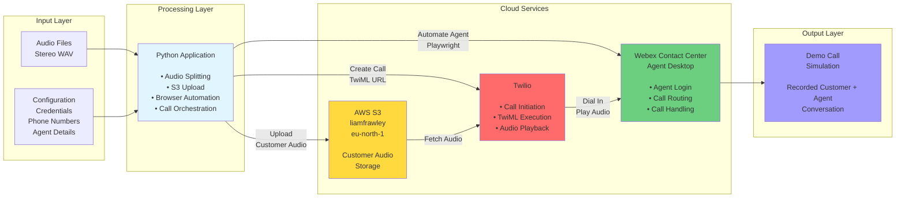
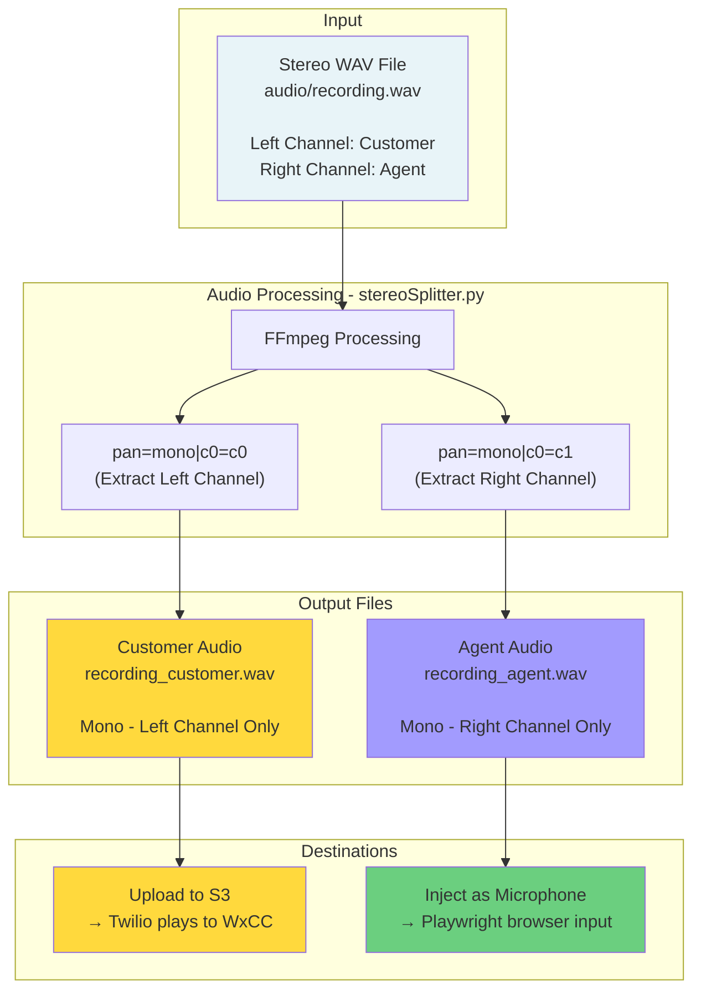
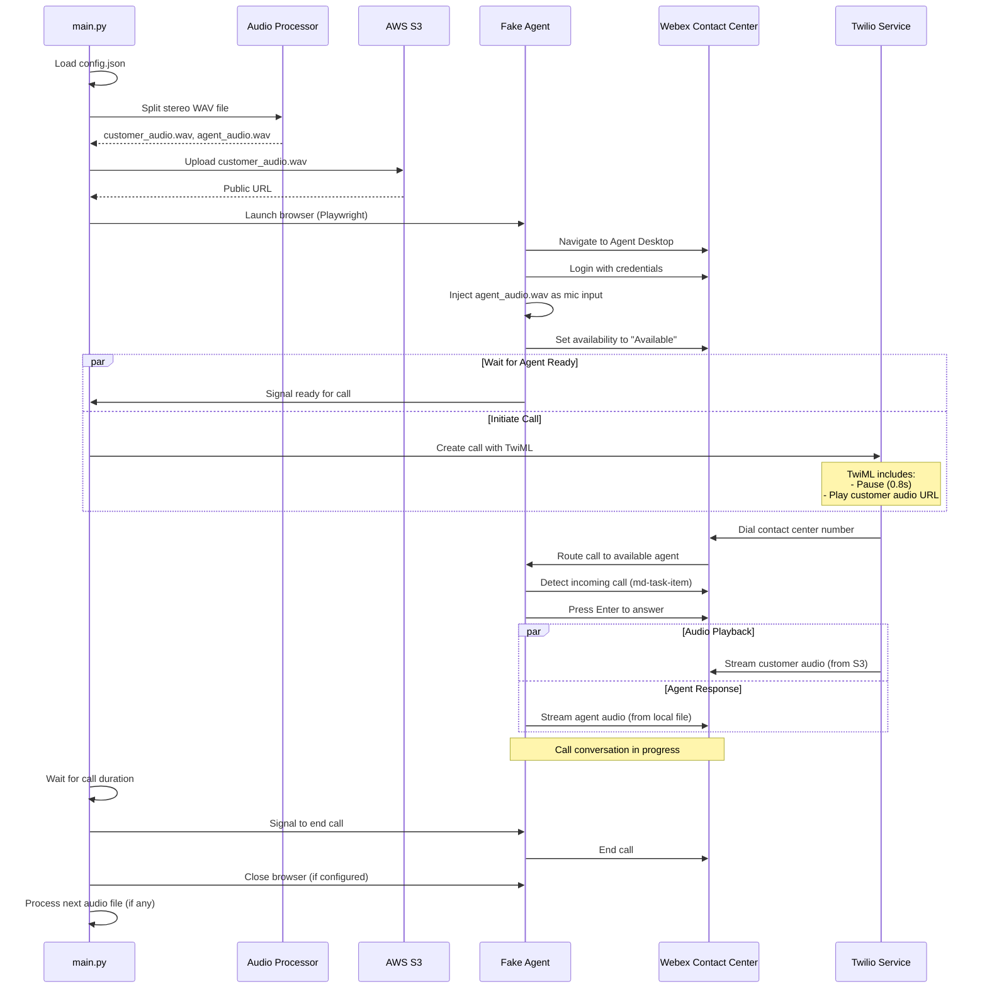

# Project Architecture Diagrams

## 1. High-Level Block Diagram - System Components



### Audio Splitting Process Detail



**Audio Split Details:**

- **Input Format**: Stereo WAV file (2 channels)
- **Left Channel**: Customer audio → uploaded to S3 → played by Twilio
- **Right Channel**: Agent audio → injected into browser → used as microphone input
- **Processing**: FFmpeg with pan filter extracts each channel independently
- **Output Format**: Two mono WAV files (PCM 16-bit, 16kHz typical)

## 2. Sequence Diagram - Call Flow



## Component Descriptions

### Python Application Components

- **main.py**: Core orchestrator that coordinates the entire workflow
- **Audio Processor**: Splits stereo recordings into separate customer and agent channels
- **S3 Upload Manager**: Handles uploading customer audio to AWS S3 with public-read permissions
- **Fake Agent Module**: Browser automation using Playwright to simulate agent behavior
  - Logs into WxCC Agent Desktop
  - Sets availability status
  - Answers incoming calls
  - Injects pre-recorded agent audio as microphone input
- **Twilio Integration**: Creates and monitors calls via Twilio REST API

### External Services

- **Twilio**: Telephony service that initiates calls and plays customer audio
- **AWS S3**: Storage for customer audio files (publicly accessible URLs)
- **Webex Contact Center (WxCC)**: Target contact center system where demo calls are routed

### Key Features

1. **Multi-Agent Support**: Can run multiple agents with different credentials and audio files
2. **Automated Audio Processing**: Automatically splits stereo files into customer/agent channels
3. **Configurable Timing**: Adjustable delay before customer audio playback
4. **Browser Automation**: Uses Playwright for realistic agent simulation
5. **S3 Integration**: Uploads audio to S3 for Twilio access

```

## Technology Stack

- **Python 3.x** - Core application language
- **Playwright** - Browser automation for agent simulation
- **Twilio API** - Telephony and call management
- **AWS Boto3** - S3 integration for audio storage
- **FFmpeg** - Audio processing and channel splitting
- **Webex Contact Center** - Target demo system
```
